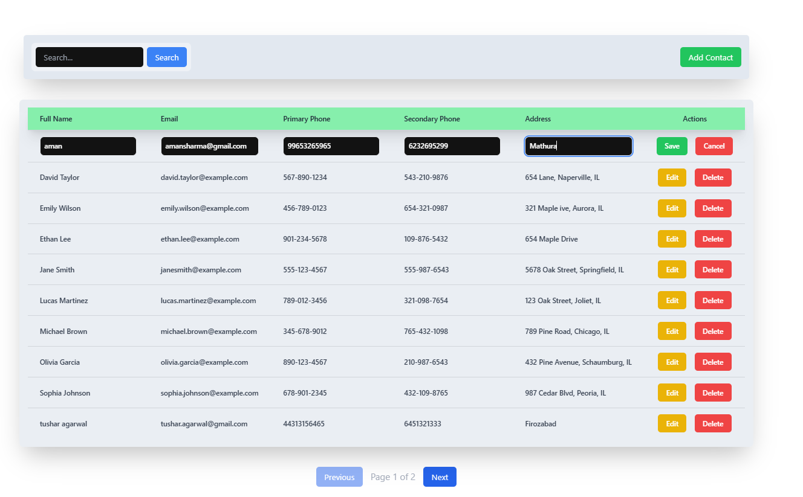

# Introduction

This project is a React-based table component that supports all CRUD (Create, Read, Update, Delete) operations.

## Features

- **CRUD Operations**: Create, read, update, and delete items directly in the table.
- **Pagination**: Divide items across pages for easier navigation.
- **Query Rules Builder**: Filter items based on specific criteria using a query builder.
- **Sorting**: Click on column headers to sort items by that property. The table is sorted by `fullname` by default.

## Frontend UI

Home page  

Add New Contact

Edit Contact

 Install Dependencies for Both Backend and Frontend

###  Backend (Node.js)
Navigate to the backend folder (e.g., server or backend directory) and install dependencies:
cd backend
$ npm install

## Frontend (React)
In a separate terminal window, navigate to the frontend folder (e.g., client or frontend directory) and install dependencies:
cd ../frontend
$ npm install

## Running the Application
1. Start the Backend Server
In the backend directory, start the Node.js server. This server provides the API for the CRUD operations.

bash npm start
The backend will run on http://localhost:8080 (or the port specified in your configuration).

1. Start the Frontend Development Server
In the frontend directory, start the React development server.

bash npm run dev
The frontend will run on http://localhost:5173 by default.

Usage
Add Items: Use the "Add" button to create a new entry in the table.
Edit Items: Click on an item to edit its details.
Delete Items: Click the "Delete" button next to an item to remove it.
Filter & Sort: Use the query rules builder to filter items, and click column headers to sort. The table is sorted by fullname by default.
License
